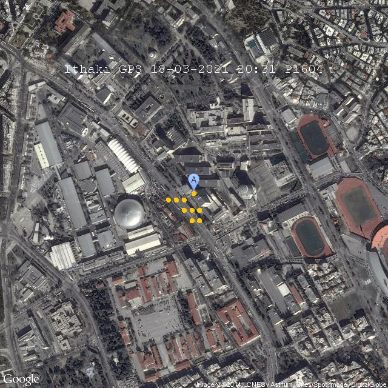
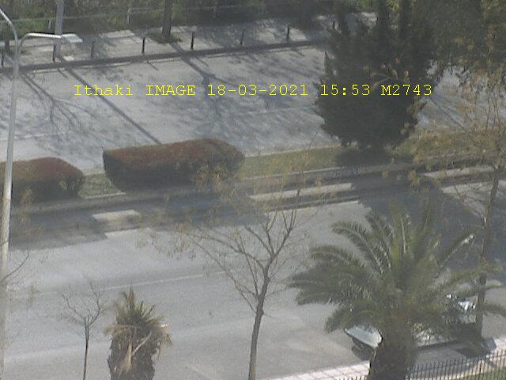
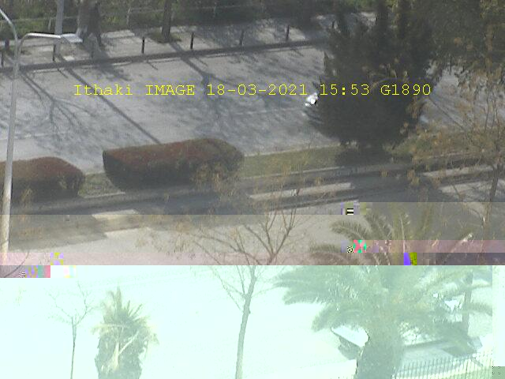

# Compile

Modify source file `src/UserApplication.java` updating the request codes taken by the Experimental Virtual Lab of the course's [website](http://ithaki.eng.auth.gr/netlab/).

TODO: Web scraping the request codes

```shell
git clone https://github.com/thodkatz/ece-networks1.git
cd ece-networks1
make
```

# GPS



# Camera

## Error-Free


## With-Erros

