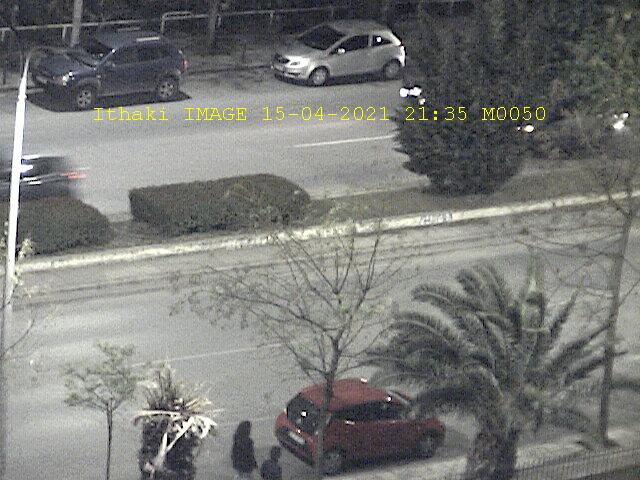

# Introduction

Sending requests to course's server "ithaki" `155.207.18.208` and collecting the corresponding data. The communication between client and server is achieved with a **virtual modem**, imported as `ithakimodem.jar` in order to write to the channel and read from it. The range of the applications for this channel includes **date** packets, **images**, **GPS** data points and an **ARQ** (Automatic Repeat Request) demo.

<div align="center">
    
   <p class="image-caption"><a href="/report/decription/ergasia1_greek.pdf">source
      </a>
   </p>
</div>

For each application, a specific request code is needed to be written in the channel. These codes are provided by the course's [website](http://ithaki.eng.auth.gr/netlab/). To automate the process, `htmlunit` framework is used for web scraping.

# Usage

```shell
git clone https://github.com/thodkatz/ece-networks1.git
cd ece-networks1
make build
make run
```
# Applications
Examples of the received data:

## GPS


## Camera

### Error-Free


### With-Erros

